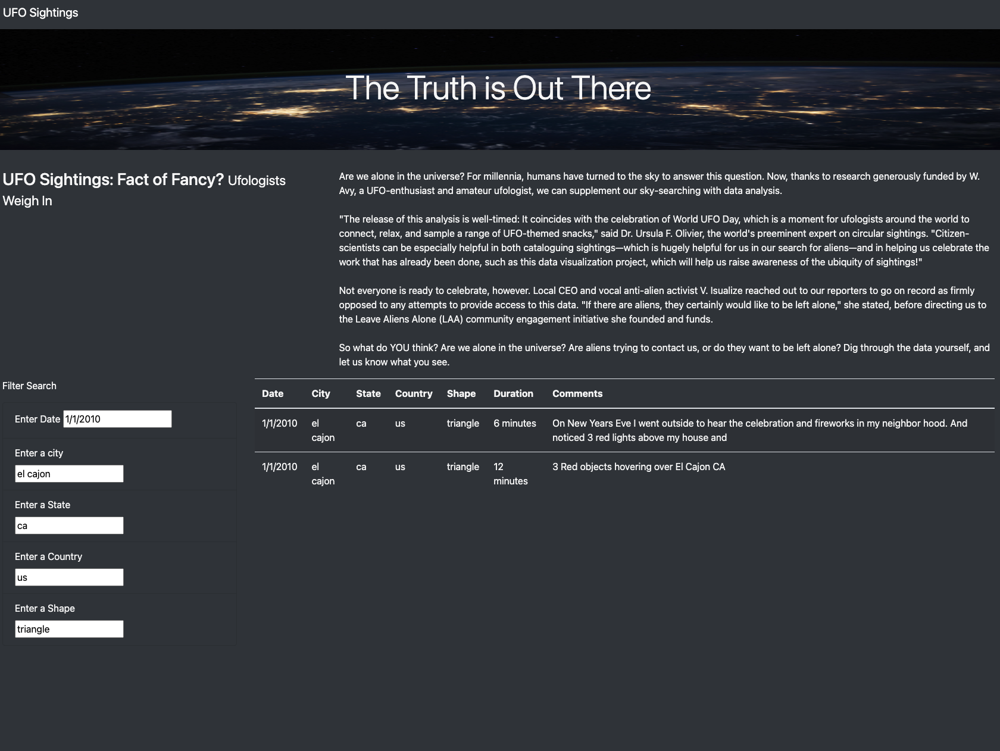

# UFO Sightings

## Overview of Project

Using JavaScript, Bootstrap and HTML,we created a webpage and dynamic tables to display data of UFO sightings by allowing users to filter for multiple criteria at the same time by adding table filters for the date, city, state, country, and shape.

## Deployed Link

https://17keerti.github.io/UFOs/

## Results

This is the overview of the webpage

After opening the webpage, user will see the filters to get the data of UFO sightings. We have 5 different filters to choose from which are date, city, state, country and shape. User can choose any of these filters by entering the input and the html page will update the result after user enters the data in input search bar. Multiple filters can be entered at the same time to search.

## Summary

One drawback of this design is that it is necessary for the user to match one of the five filters with the data in our javascript in order for the result to be returned.
Two recommendations for further development-

1. We are limited to the data in only one js file. We could use Web Scraping to get more data to display the results.
2. We can add one more filter for duration and we can add one more section for the people to add their sightings.
